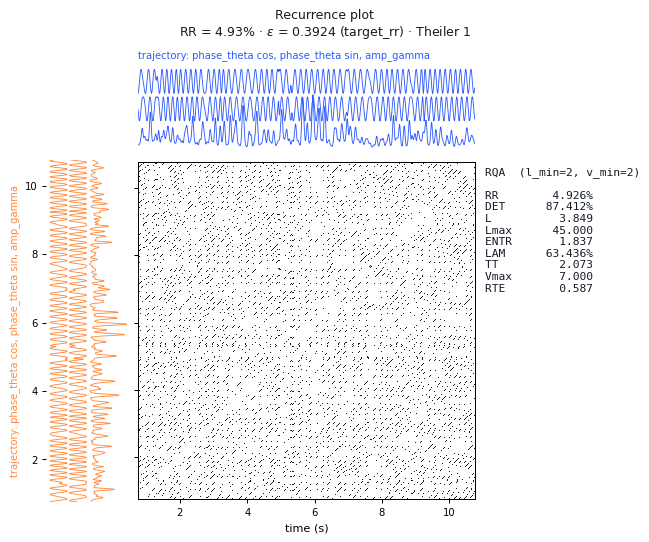
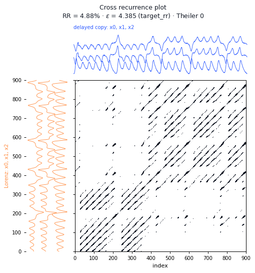
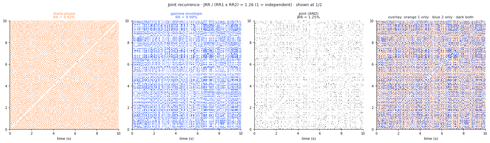
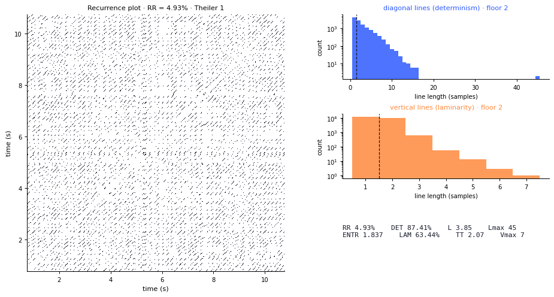
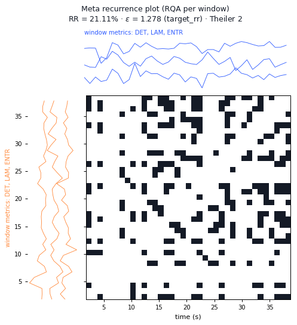

<p align="center">
  <picture>
    <source media="(prefers-color-scheme: dark)" srcset="docs/_static/recurra-lockup-dark.svg">
    
  </picture>
</p>

# recurra

Recurrence analysis over **arbitrary state spaces**, for multivariate signals and cross-frequency coupling (CFC).

Unlike existing RQA libraries, the phase space is not necessarily built by Takens delays: it can be defined from observable variables — for instance `s(t) = (cos φ_low, sin φ_low, A_high)` for PAC — or by combining both routes. Nothing forces the coupling reading: the same engine serves signals with no coupling at all.

> **Status: pre-alpha, 0.25.0.dev0.** Every phase except F11 (higher-order tensors) and F12 (Costas arrays) is implemented and tested: 509 test functions, 603 cases. The library has carried one complete real study, a 49-child EEG corpus. What remains is listed in [`docs/ROADMAP.md`](docs/ROADMAP.md).

---

## Installation

```bash
pip install "git+https://github.com/IgnacioRodro/recurra.git"
# development
git clone https://github.com/IgnacioRodro/recurra.git && cd recurra
pip install -e ".[dev]"
```

Extras: `io` (EDF/HDF5) · `ml` (scikit-learn) · `viz` (matplotlib, Pillow) · `parallel` (joblib) · `dev` · `all`

The core needs only `numpy>=1.24`, `scipy>=1.10` and `pandas>=1.5`. Both ends of
that range are verified by running the full suite: Python 3.10.9 with pandas
1.5.3 on Windows, and Python 3.12.3 with pandas 3.0.2 on Linux.

---

## Minimal example

```python
import numpy as np, recurra as rc
from recurra import statespace as sm

# 1. Synthetic signal with controlled PAC
sig = rc.generate_cfc(modality="pac", duration=30.0, fs=500.0,
                      alpha=0.8, preferred_phase=np.pi/2, snr_db=15.0, seed=42)

# 2. Into the pipeline
rec = sig.to_recording("sub01")
rec = rc.filterbank(rec, {"theta": (4, 8), "gamma": (50, 70)})
rec = rc.analytic(rec, sources=["theta", "gamma"])

# 3. State space: s(t) = (cos phi_low, sin phi_low, A_high)
# envelope smoothed at 1.5x the phase band's upper edge (Gaussian, sign-preserving)
ss = sm.pac_space(rec, smooth=12.0)
print(ss.summary())

# 4. Recurrence, at a fixed recurrence rate rather than a fixed epsilon
th = rc.threshold(ss, target_rr=0.05, rng=0)       # Theiler window 1: the line of identity
rm = rc.recurrence_plot(ss, th)                     # inherits the threshold's window
print(rm.summary())

# 5. Everything is recorded, and everything can be exported
rc.save_figure(rc.plot_recurrence(rm), "recurrence.png")
rc.export_frame(rm.describe(), "recurrence_summary")

# 6. Or the same record as ten overlapping windows
wr = rc.windowed_recurrence(ss, rc.WindowSpec(n_windows=10, overlap=0.5),
                            target_rr=0.05, theiler=1, rng=0)
print(wr.metrics())        # one tidy row per window
```

Runnable examples: `example_01_pipeline.py` (ingestion, preprocessing, generator), `example_02_statespace.py` (16 constructors, route comparison), `example_03_recurrence.py` (thresholds, RP/CRP/JRP, run report), `example_04_windowed.py` (windowed analysis with overlap, multi-subject corpus), `example_05_comparability.py` (cross-subject comparability, two-group separation).

Run all of them at once, with a summary of what each produced:

```bash
python examples/run_all.py              # everything, into ./outputs
python examples/run_all.py --skip 6     # without the cookbook
python examples/run_all.py --only 3 4   # just these
```

`examples/example_06_cookbook.py` is different: 106 numbered Spyder cells covering
every command and configuration in the library, meant to be run one cell at a time.
See [`docs/INSTALL.md`](docs/INSTALL.md) for setting this up in Spyder.

---

## What it draws

Every recurrence structure is drawn with the trajectories that made it along
its margins -- the *x* component along the top, the *y* component along the
left, as in the logo -- optionally with its RQA measures beside it.

| Recurrence plot with its signals and RQA | Cross recurrence: Lorenz against a delayed copy |
|---|---|
|  |  |

| Joint recurrence, decomposed: each subsystem, their conjunction, the overlay |
|---|
|  |

| Line-length distributions behind DET and LAM | Meta recurrence: the RQA measures window by window |
|---|---|
|  |  |

`recurra figures` lists every figure; `python tools/make_gallery.py`
regenerates these.

---

## What is implemented

| Area | Status |
|---|---|
| Ingestion: 11 input shapes, roles, quality checks | ✅ |
| Immutable `Recording` with copy-on-write | ✅ |
| Capability system | ✅ |
| Provenance and CSV export with sidecars | ✅ |
| Filtering and Hilbert decomposition | ✅ |
| Scaling policy for heterogeneous blocks | ✅ |
| CFC generator (PAC/PPC/AAC/PPA), validated | ✅ |
| Canonical indices (MVL, MI, PLV, AAC) | ✅ |
| State space: 16 constructors, three routes | ✅ |
| Embedding estimation (AMI/ACF/FNN/Cao) | ✅ |
| Thresholds: 8 modes, achieved rate reported | ✅ |
| RP, CRP and JRP with exact streaming | ✅ |
| Memory planner | ✅ |
| Plain-text run reports | ✅ |
| **Windowed RP/CRP/JRP with overlap** | ✅ |
| Multi-subject batch, lazy matrices | ✅ |
| Comparability contracts and group separation | ✅ |
| Figures: 17 single + 8 comparison | ✅ |
| RQA: 14 metrics, streamed line histograms | ✅ |
| CRQA: lag and direction from a cross plot | ✅ |
| Dynamical measures: D₂, λ₁, K₂, fractals, entropies, Hjorth, LZ | ✅ |
| Dynamical measures in the windowed and corpus tables | ✅ |
| Synthetic validation: artefacts, detection, window length, four modalities | ✅ |
| Parallelism across subjects and windows | ✅ |
| Classification: grouped folds, repeats, permutation test | ✅ |
| Real recordings: EDF with units, metadata and annotations | ✅ |
| Corpus on disk joined to a participants table | ✅ |
| Recurrence plots and attractors as images | ✅ |
| Distribution shape per block, as a column | ✅ |
| Higher-order tensors, Costas arrays | 📋 later |

---

## Documentation

- [`docs/DESIGN_DECISIONS.md`](docs/DESIGN_DECISIONS.md) — every decision with its reasoning and the alternatives rejected
- [`docs/ARCHITECTURE.md`](docs/ARCHITECTURE.md) — taxonomies, objects, contracts
- [`docs/EXAMPLES.md`](docs/EXAMPLES.md) — usage examples for everything
- [`docs/INSTALL.md`](docs/INSTALL.md) — installation, Spyder setup, troubleshooting
- [`docs/TESTS.md`](docs/TESTS.md) — what every test checks, in execution order
- [`docs/EXAMPLE_INDEX.md`](docs/EXAMPLE_INDEX.md) — what every example produces, figure by figure
- [`docs/ROADMAP.md`](docs/ROADMAP.md) — what is pending, what should migrate into the library, release checklist

---

## Design principles

**P1** Separate state space / recurrence engine / metrics ·
**P2** The N×N matrix is an implementation detail, not the API ·
**P3** No silent simplification ·
**P4** Units always explicit ·
**P5** Reproducibility by construction ·
**P6** Graceful degradation of dependencies ·
**P7** Declared memory budget

---

## Tests

```bash
pytest -m "not slow"   # 514 tests in about 8 minutes
pytest                 # all 545, including the validation findings
```

Ground-truth tests included: RMS pairwise distance of the unit circle = √2 (analytic), coupling strength monotone against MVL and MI (Spearman ρ = 1.00), embedding dimension **m = 3** recovered for Lorenz via AMI + normalised FNN, a pure sine giving dense diagonals exactly at multiples of its period, **bit-for-bit** equivalence between tiled streaming and the dense computation, and a windowed joint-recurrence index that ranks eight subjects perfectly against their true coupling strength (Spearman +1.000), two-group separation on twenty subjects at mean AUC 0.972, line histograms identical to a dense reference across 48 combinations, DET matching its analytic value for white noise, and the correlation dimension of Lorenz recovered as 2.012 against a reference of 2.05.

---

## License and citation

MIT: use, modify and redistribute freely, see [`LICENSE`](LICENSE). Citation
is not required; if recurra is useful in published work, a citation is
appreciated -- GitHub's *Cite this repository* button uses
[`CITATION.cff`](CITATION.cff).
